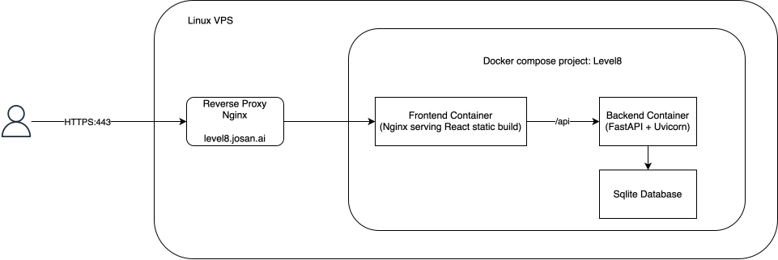

# Level8 

An interactice Dashboard for Factor VIII monitoring.

The purpose of the project is to make people gain a better understanding of the halflife of different medicines, and how to optimize for a week where the patient needs a higher baseline of factor (e.g. going skiing for one week)

# Disclosure
 
This project is **not medical advice**, but made for educational purposes.

# Architecture
